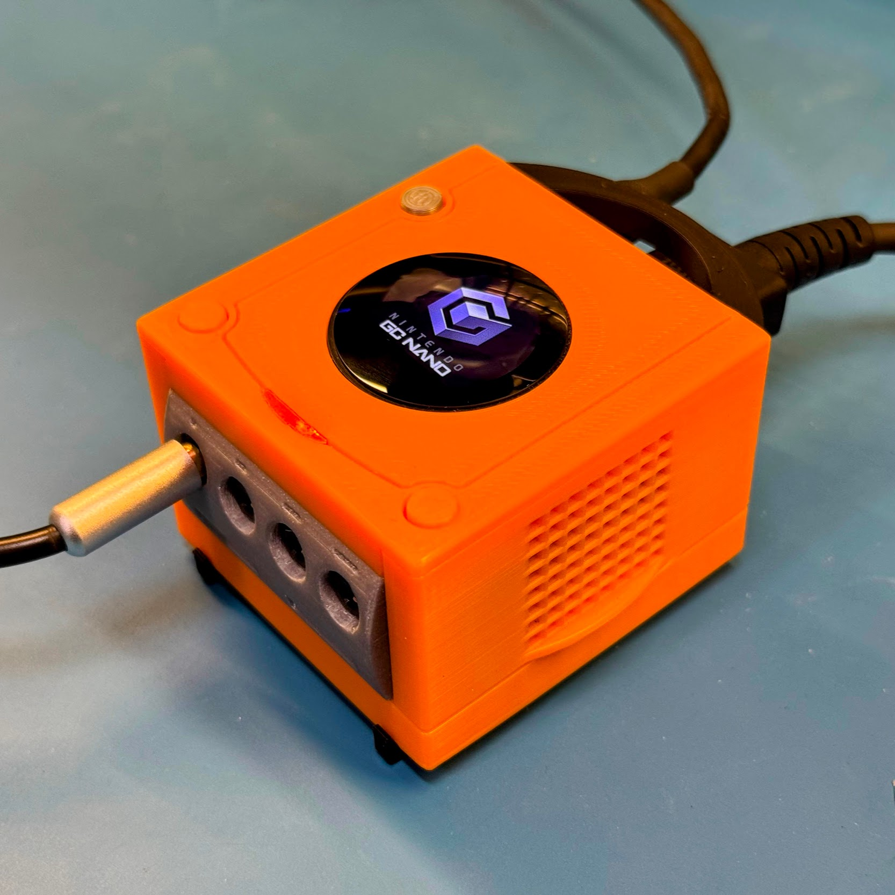
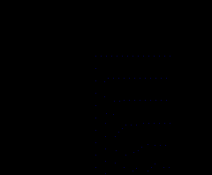

# GC Nano LCD Jewel

Custom LCD "jewel" insert for the [GC Nano](https://bitbuilt.net/forums/threads/gc-nano-the-worlds-smallest-gamecube.5697/), using an ESP32-S3 and a lensed 0.96" round LCD.

## Features

- Fits in an unmodified GC Nano shell
- Displays a static or animated GIF (240x198, < 1920KB)
- WiFi access point and web interface for uploading new GIFs
- OTA firmware updates so you don't have to open the case again

## Bill of Materials

- ESP32-S3 Super Mini (or similar) - [AliExpress](https://www.aliexpress.us/item/3256808827955225.html)
- 0.96" 240x198 Round LCD - [AliExpress](https://www.aliexpress.us/item/3256806072157291.html)
- Some wire
- 3D printed insert (see [`hardware/` folder](hardware/))

## Uploading GIFs

- Connect to the "GCNANO-XXXXXX" WiFi network (password: "bitbuilt")
- Open a web browser and navigate to <http://gcnano.local>
- Upload the GIF!

## Pre-made GIFs

There are a couple of pre-made GIFs in the [`gifs/` folder](gifs/). If you want to make your own, make sure to resize it to 240x198 and keep the file size under 1920KB. Please send me your GIFs and I'll add them to the collection!

<table>
  <tr>
    <td></td>
    <td></td>
  </tr>
</table>